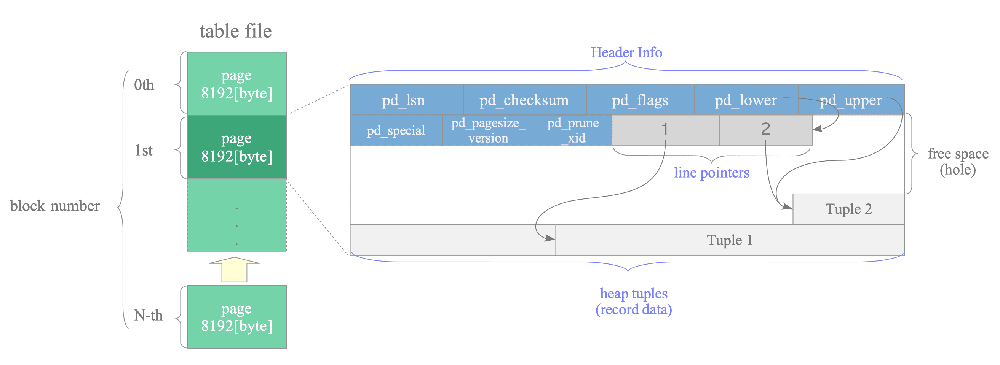

# Heap

What we'll survey:
- heap
- execution plan
- cache

## Database implementation

Why don't we use CSV files on S3 buckets ?
Because we want to enforce data integrity. 

You can't use a database without index, why ?
Because access would be slow, why ?
Because data should be read on fs, which is 10⁵ slower that memory, why ?
Because it can't fit in memory, why ?
Because huge amount of data today, and memory is expensive.

## Table is heap

There is several data structures in database to store data:
- "heap-organized" table, also called heap;
- "index-organized" table, also called IOT;
- "hash-cluster" table.

We usually refer "heap-organized" table, and this is the only storage available in PostgreSQL.

What is a heap ?

It is not [the usual definition](https://stackoverflow.com/questions/1699057/why-are-two-different-concepts-both-called-heap) 
It is rather an area of storage which is unsorted, as in laundry heap.
You put all you used clothes in your laundry basket, in no order but of use.
You need to wash all clothes in one batch, you don't need to sort them.
But once washed and dried, you don't store all clothes in one heap, you put apart trousers and socks.

Heap is optimized for: 
- write, to be able to persist data as fast as possible;
- read, if you access all data.

Heap is not optimized for :
- read, if you need some data.


## Create a table

Create a table
```postgresql
DROP TABLE IF EXISTS mytable ;

CREATE TABLE mytable (
    id  integer
) WITH (AUTOVACUUM_ENABLED = FALSE);
```

## How is a table stored ?

Each table is stored in a different file; when table grows, more file are created.

> Each table is stored in a separate file (named after the table filenode number, which can be found in pg_class.relfilenode).
> When a table exceeds 1 GB, it is divided into gigabyte-sized segments.
> The first segment's file name is the same as the filenode; subsequent segments are named filenode.1, filenode.2, etc. This arrangement avoids problems on platforms that have file size limitations.
> A table that has columns with potentially large entries will have an associated TOAST table, which is used for out-of-line storage of field values that are too large to keep in the table rows proper.

from [PostgreSQL doc](https://www.postgresql.org/docs/current/storage-file-layout.html)

If you record exceeds 8kb, it will be stored separately in a file named TOAST.

> PostgreSQL uses a fixed page size (commonly 8 kB), and does not allow tuples to span multiple pages.
> Therefore, it is not possible to store very large field values directly.
> To overcome this limitation, large field values are compressed and/or broken up into multiple physical rows.
> This happens transparently to the user, with only small impact on most of the backend code.
> The technique is affectionately known as TOAST (or “the best thing since sliced bread”, The Oversized-Attribute Storage Technique).

from [PostgreSQL doc](https://www.postgresql.org/docs/current/storage-toast.html)

[More](https://www.interdb.jp/pg/pgsql01/02.html#123-layout-of-files-associated-with-tables-and-indexes)

Find its physical location
```postgresql
SELECT pg_relation_filepath('mytable')
```
base/16384/16404


Get file size
```shell
just storage
ls -lh base/16384/16404
```

You get
```text
-rw------- 1 postgres postgres 0 Jan 29 09:42 base/16384/16404
```

The file is empty (0 bytes)

## Create a row

Add data
```postgresql
INSERT INTO mytable (id) VALUES (-1);
SELECT * FROM mytable;
```

Get file size again
```shell
ls -lh base/16384/16404
```

You get
```text
-rw------- 1 postgres postgres 8.0K Jan 29 09:42 base/16384/16404
```

The file is 8192, why ?
If we follow the rules below, it should be 4 bytes.
Where does this 1020 bytes overhead comes from ? 

Fixed-size types are the following. 

| Name      | Storage Size   | 
|-----------|----------------|
| integer   | 4 bytes        | 
| bigint    | 8 bytes        |
| date      | 4 bytes        |
| timestamp | 8 bytes        |

[Source](https://www.postgresql.org/docs/18/datatype-numeric.html)
[Source](https://www.postgresql.org/docs/18/datatype-datetime.htmll)

Text is variable-size type. 
In ISO, it is 1 to 4 bytes per character.
In UTF-8, it is 1 to 4 bytes per character.

[Source](https://www.postgresql.org/docs/current/multibyte.html)

You can also call a function on the actual data (useful on text) 
```postgresql
SELECT
    pg_size_pretty(pg_column_size(123456)::BIGINT)       integer_size,
    pg_size_pretty(pg_column_size(NOW())::BIGINT)        timestamp_size,
    pg_size_pretty(pg_column_size('ABCDEFGHIJ')::BIGINT) text_size
```


## How is a row stored ?

PostgreSQL allocate space in filesystem in chunks to improve performance :
- several rows will be written;
- allocate space (writing a file) require a system call which is expensive.

These chunks are called blocks, their size is 8 kBytes = 8 * 1 024 bytes = 8 192 bytes.

Rows are stored in these blocks.
Rows are also called tuples or items.

A row is stored contiguously, we have a "row store" - not a column store as in BigQuery.

A row will have a variable length, e.g. if using variable-size text.

Note:
- fixed-size field may be stored [using more space than needed](https://www.cybertec-postgresql.com/en/type-alignment-padding-bytes-no-space-waste-in-postgresql/) : 
- NULL values does not store any content.

To be able to access variable-length rows quickly, in an indexed way, we should use pointers.

To save more space, as we can't know how many rows will be stored:
- pointer are stored at block's start;
- rows are stored at block's end.

PostgreSQL need to access row quickly internally (e.g. for indexes) and can't use the row primary key (it may not exist).
So it use an internal identifier, which relate to the physical address. 

But to save even more space, we may need to move row in the block without updating this internal identifier.

How can we do that ? We recall the fundamental theorem of software engineering
> We can solve any problem by introducing an extra level of indirection

We'll use a pointer to pointer :
- row addresses are hidden;
- block pointer expose an identifier called Current Tuple IDentifier (CTID);
- its syntax is `(block_number, row_number)` e.g. `(0, 1)`.


You can query using the pointer
```postgresql
SELECT id, ctid
FROM mytable
WHERE 1=1
    AND id = -1
    AND ctid = '(0,1)'
```          

> Every table is stored as an array of blocks.
> All the blocks are logically equivalent, so a particular item (row) can be stored in any blocks.
> The first 24 bytes of each page consists of a block header.
> Following are item identifiers, the rows themselves are stored in space allocated backwards from the end of unallocated space.
> Because an item identifier is never moved until it is freed, its index can be used on a long-term basis to reference an item.
> Every pointer to an item created by PostgreSQL consists of a page number and the index of an item identifier.

[PostgreSQL docs](https://www.postgresql.org/docs/current/storage-page-layout.html#STORAGE-TUPLE-LAYOUT)


All in all, the storage looks like this



[More](https://www.interdb.jp/pg/pgsql01/03.html)

## Create many rows

Add many rows (last 4 seconds)
```postgresql
INSERT INTO mytable (id)
SELECT n
FROM generate_series(1, 10_000_000) AS n;
```

Check what happened on disk
```shell
du -sh base/16384/16404
```

You get
```text
346M	base/16384/16404
```

The data has been written to disk, 346 MB

You can also query the filesystem here
```postgresql
SELECT pg_size_pretty(data_file.size::BIGINT)
FROM pg_stat_file(pg_relation_filepath('mytable')) AS data_file 
```
346 MB


How much space is used for actual data ?
What is the storage overhead ? We saw there is much overhead for an empty block.
Now, what is this overhead for a whole table ?

We have 10 millions rows, one integer for each row (4 bytes) 
```postgresql
WITH data_file AS (
    SELECT data_file.size AS size 
    FROM pg_stat_file(pg_relation_filepath('mytable')) AS data_file
)
SELECT 
    pg_size_pretty(10_000_000 * 4::BIGINT) data_size,
    TRUNC((10_000_000 * 4) / data_file.size ::NUMERIC * 100) || ' %' pct,
    pg_size_pretty(data_file.size)         table_size
FROM data_file
```
| data\_size | pct  | table\_size |
|:-----------|:-----|:------------|
| 38 MB      | 11 % | 346 MB      |


The overhead is 89%.

## Get table size easily

### Size on disk (bytes)

If we want to know the size without looking into the datafile, we can call `pg_table_size` function.
```postgresql
SELECT 
    pg_table_size('mytable')                  table_size_bytes,
    pg_size_pretty(pg_table_size('mytable'))  table_size,
    pg_size_pretty(pg_relation_size('mytable','main'))  table_size
```
346 MB

```postgresql
select *
from pg_catalog.pg_statio_user_tables
order by pg_relation_size(relid) desc;
```

### Size on disk (rows)

How many rows ? Check `pg_stat_user_tables`
```postgresql
SELECT
    stt.relname                        table_name
   ,stt.n_live_tup                    row_count
FROM pg_stat_user_tables stt
WHERE 1=1
   AND relname = 'mytable'
;
```

All `pg_stat*` views belong to PostgreSQL's cumulative statistics system.
These statistics are collected by the processes themselves, so they are roughly "up-to-date".
> a query or transaction still in progress does not affect the displayed totals and the displayed information lags behind actual activity
> accessed values are cached until the end of its current transaction
[Reference](https://www.postgresql.org/docs/current/monitoring-stats.html)

[More size statistics](https://www.postgresql.org/docs/current/functions-admin.html#FUNCTIONS-ADMIN-DBSIZE)

### Size on disk (blocks)

How many blocks ? Check `pg_class`
```postgresql
SELECT 
    relpages  block_count,
    reltuples row_count
FROM pg_class WHERE relname = 'mytable';
```

You get

| block\_count | row\_count |
|:-------------|:-----------|
| 0            | -1         |


`pg_class` is not in PostgreSQL's cumulative statistics system, so it is not updated automatically.

The documentation make it explicit 

> This is only an estimate used by the planner. It is updated by VACUUM, ANALYZE, and a few DDL commands such as CREATE INDEX.
[Reference](https://www.postgresql.org/docs/current/catalog-pg-class.html)

We should do run ANALYZE; here we do it on the table only. 
```postgresql
ANALYZE VERBOSE mytable
```

How many blocks ?
```postgresql
SELECT 
    relpages  block_count,
    reltuples row_count
FROM pg_class WHERE relname = 'mytable';
```

You get
| block\_count | row\_count |
|:-------------|:-----------|
| 44248        | 10000048   |


## Access rows and get table usage 

Query first 10 rows of table
```postgresql
SELECT id 
FROM mytable
LIMIT 10
```

You can know how the table has been accessed
```postgresql
SELECT
     'events:'
     ,stt.n_tup_ins                     insert_count
     ,stt.n_tup_upd + stt.n_tup_hot_upd update_count
     ,stt.n_tup_del                     delete_count
     ,stt.last_seq_scan                 last_read
     ,stt.seq_tup_read                  rows_read_count
--,stt.*
FROM pg_stat_user_tables stt
WHERE 1=1
  AND relname = 'mytable'
;
```
| ?column? | insert\_count | update\_count | delete\_count | last\_read                        | rows\_read\_count |
|:---------|:--------------|:--------------|:--------------|:----------------------------------|:------------------|
| events:  | 10000001      | 0             | 0             | 2025-07-29 08:55:55.281912 +00:00 | 10                |


[Reference](https://www.postgresql.org/docs/current/monitoring-stats.html#MONITORING-PG-STATIO-ALL-TABLES-VIEW)

## Modify rows 

Trigger events and check they appear
```postgresql
UPDATE mytable 
SET id = 1
WHERE id = -1;
```

Delete a non-existent row
```postgresql
DELETE FROM mytable
WHERE id = -1;
```
No delete is accounted for

Delete an existing row
```postgresql
DELETE FROM mytable
WHERE id = 1;
```

```postgresql
SELECT
     'events:'
     ,stt.n_tup_ins                     insert_count
     ,stt.n_tup_upd + stt.n_tup_hot_upd update_count
     ,stt.n_tup_del                     delete_count
     ,stt.last_seq_scan                 last_read
     ,stt.seq_tup_read                  rows_read_count
--,stt.*
FROM pg_stat_user_tables stt
WHERE 1=1
  AND relname = 'mytable'
;
```


## Reuse space

Delete all rows
```postgresql
DELETE FROM mytable WHERE true
```

Check size
```postgresql
SELECT pg_size_pretty(pg_table_size('mytable'))  table_size
```
Still 346 MB

Check size on disk: it is still there.
```text
-rw------- 1 postgres postgres 346M Jul 29 09:07 base/5/16395
```

But of course you can't access it
```postgresql
SELECT *
FROM mytable
```

Add many rows: 10 million (last 40 seconds)
```postgresql
INSERT INTO mytable (id)
SELECT n
FROM generate_series(1, 10000000) AS n;
```

Check size
```postgresql
SELECT pg_size_pretty(pg_table_size('mytable'))  table_size
```
692 MB

The space has not been freed.

Can we check unused space, and reuse it ?
```postgresql
SELECT
   stt.relname                        table_name
   ,stt.n_live_tup                    active_row_count
   ,stt.n_dead_tup                    deleted_row_count
FROM pg_stat_user_tables stt
WHERE 1=1
   AND relname = 'mytable'
;
```

| table\_name | active\_row\_count | deleted\_row\_count |
|:------------|:-------------------|:--------------------|
| mytable     | 10000000           | 10000000            |


Let's reuse it
```postgresql
VACUUM VERBOSE mytable;
```

Check message
```text
tuples: 10000000 removed, 10000000 remain, 0 are dead but not yet removable
```

Check deleted rows are not here anymore.
```postgresql
SELECT
   stt.relname                        table_name
   ,stt.n_live_tup                    active_row_count
   ,stt.n_dead_tup                    deleted_row_count
FROM pg_stat_user_tables stt
WHERE 1=1
   AND relname = 'mytable'
;
```

| table\_name | active\_row\_count | deleted\_row\_count |
|:------------|:-------------------|:--------------------|
| mytable     | 10000000           | 0                   |


Check size
```postgresql
SELECT pg_size_pretty(pg_table_size('mytable'))  table_size
```
Still 692 MB

Let's add rows again
```postgresql
INSERT INTO mytable (id)
SELECT n
FROM generate_series(1, 10000000) AS n;
```

Check size
```postgresql
SELECT pg_size_pretty(pg_table_size('mytable'))  table_size
```
Still 692 MB: rows are been inserted without using more space

## Give back unused space to OS

Let's delete most of the rows
```postgresql
DELETE FROM mytable
WHERE id > 1000;

SELECT COUNT(*) FROM mytable;
```

And mark them for reuse
```postgresql
VACUUM VERBOSE mytable;
```

Let's suppose we load some table by error and want to give back the space to OS, so it can use it, by example for another table.

First, you cannot search the stats to check if there is a lot of space to reuse.
```postgresql
SELECT
   stt.*
FROM pg_stat_user_tables stt
WHERE 1=1
   AND relname = 'mytable'
;
```

The [native solution](https://github.com/pgexperts/pgx_scripts/blob/master/bloat/table_bloat_check.sql) is to compare:
- the size of the data;
- the size of the table.

A friendlier solution is to use an extension.
```postgresql
CREATE EXTENSION pgstattuple;
```
```postgresql
SELECT
    pg_size_pretty(tuple_len)       alive_size,
    pg_size_pretty(dead_tuple_len)  dead_size,
    pg_size_pretty(free_space)      unused_size,
    pg_size_pretty(table_len)       total_size
FROM pgstattuple('mytable')    
```

You can see unused size is 344MB
| alive\_size | dead\_size | unused\_size | total\_size |
|:------------|:-----------|:-------------|:------------|
| 55 kB       | 0 bytes    | 344 MB       | 346 MB      |


You can actually give back the unused disk space to OS
```postgresql
VACUUM FULL mytable
```

Check size
```postgresql
SELECT pg_size_pretty(pg_table_size('mytable'))  table_size
```
72 kB

## Empty the table

If you need to delete all rows, use `TRUNCATE` instead of `DELETE`, as it will release the space automatically.
```postgresql
TRUNCATE TABLE mytable
```

Check size on disk: it is now empty
```text
-rw------- 1 postgres postgres 0 Jul 29 08:54 base/5/16385
```

Check size
```postgresql
SELECT pg_size_pretty(pg_table_size('mytable'))  table_size
```
0 bytes

Remember that table statistics keep on going, even if you truncated the table.
```postgresql
SELECT
     'events:'
     ,stt.n_tup_ins                     insert_count
     ,stt.n_tup_upd + stt.n_tup_hot_upd update_count
     ,stt.n_tup_del                     delete_count
     ,stt.last_seq_scan                 last_read
     ,stt.seq_tup_read                  rows_read_count
--,stt.*
FROM pg_stat_user_tables stt
WHERE 1=1
  AND relname = 'mytable'
;
``` 

If you need it, you can reset these stats
```postgresql
SELECT pg_stat_reset_single_table_counters('mytable'::regclass);
```

