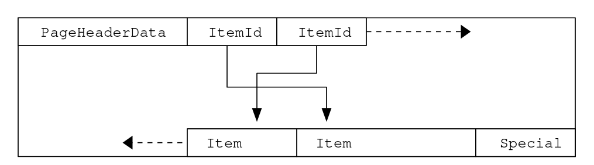
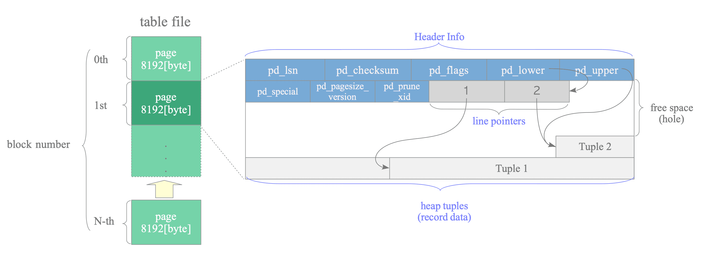

# Persistence

## How to implement a database ?

Point down the main function of a database:
- consistency;
- response time.

Q: Why don't we implement database over CSV files on S3 buckets ? We would have automatic recovery.
A: Because we want to enforce data integrity. 

Q: You may not be able to run a database without index, why ?
A: Because access would be slow.

Q: Why is it so ?
A: Because data should be read on fs, which is 10⁵ slower that memory.

Q: Why can't we read everything from memory then ?
A: Because it wouldn't fit.

Q: Why is it so ?
A: Because we deal with huge amount of data today, and memory is expensive.

## Table is heap

There is several data structures in database to store data:
- "heap-organized" table, also called heap;
- "index-organized" table, also called IOT;
- "hash-cluster" table.

Heap is the only storage available in PostgreSQL.

What is a heap ?

It is not [the usual definition](https://stackoverflow.com/questions/1699057/why-are-two-different-concepts-both-called-heap) from computer science, related to memory allocation (e.g. Java Heap). 
It is rather an area of storage which is unsorted, as in laundry heap.
You put all you used clothes in your laundry basket, in no order but of use.
You need to wash all clothes in one batch, you don't need to sort them (except for wool).

But once washed and dried, you don't store all clothes in one heap. You put apart trousers and socks, because you need to pick out one pair of socks in the morning. You store your suit apart, cause you use it maybe once a year for weddings.

Heap is optimized for: 
- write, to be able to persist data as fast as possible;
- read, if you access **all** data.

Heap is not optimized for :
- read, if you need **some** data.

The only faster method if you only need to write is append-only (hadoop, kafka), but it makes reading much slower.

## How is a table stored ?

Create a table
```postgresql
DROP TABLE IF EXISTS mytable ;

CREATE TABLE mytable (
    id  integer
) WITH (AUTOVACUUM_ENABLED = FALSE);
```

What has happened ? A regular OS file has been created.

Each table is stored in a different file.
When table grows too big, more file are created.

Find its physical location
```postgresql
SELECT pg_relation_filepath('mytable')
```
base/16384/16404


Get file size
```shell
just storage
ls -lh base/16384/16404
```

You get
```text
-rw------- 1 postgres postgres 0 Jan 29 09:42 base/16384/16404
```

The file is empty (0 bytes)

> Each table is stored in a separate file (named after the table filenode number, which can be found in pg_class.relfilenode).
> When a table exceeds 1 GB, it is divided into gigabyte-sized segments.
> The first segment's file name is the same as the filenode; subsequent segments are named filenode.1, filenode.2, etc. This arrangement avoids problems on platforms that have file size limitations.
> A table that has columns with potentially large entries will have an associated TOAST table, which is used for out-of-line storage of field values that are too large to keep in the table rows proper.

from [PostgreSQL doc](https://www.postgresql.org/docs/current/storage-file-layout.html)


## Create a row

Add data
```postgresql
INSERT INTO mytable (id) VALUES (-1);
SELECT * FROM mytable;
```

Get file size again
```shell
ls -lh base/16384/16404
```

You get
```text
-rw------- 1 postgres postgres 8.0K Jan 29 09:42 base/16384/16404
```

The file is 8192, why ? If we follow the rules below, it should be 4 bytes.
Where does this 1020 bytes overhead comes from ? 

## Properties size

You sometimes need to know how much space data is taking at the record level, which depends on each row column type.

The most common fixed-size types are the following.

| Name      | Storage Size   | 
|-----------|----------------|
| integer   | 4 bytes        | 
| bigint    | 8 bytes        |
| date      | 4 bytes        |
| timestamp | 8 bytes        |

[Source on integer](https://www.postgresql.org/docs/18/datatype-numeric.html)
[Source on date](https://www.postgresql.org/docs/18/datatype-datetime.htmll)

The most common variable-size type is text, and its size depends on encoding:
- in ISO, it is 1 to 4 bytes per character;
- in UTF-8, it is 1 to 4 bytes per character.

[Source](https://www.postgresql.org/docs/current/multibyte.html)

To get the actual size of a value, before storage, call `pg_column_size` function. 
```postgresql
SELECT
    pg_size_pretty(pg_column_size(123456)::BIGINT)       integer_size,
    pg_size_pretty(pg_column_size(NOW())::BIGINT)        timestamp_size,
    pg_size_pretty(pg_column_size('a')::BIGINT)          one_char_size,
    pg_size_pretty(pg_column_size('ab')::BIGINT)         two_char_size,
    pg_size_pretty(pg_column_size('é')::BIGINT)          one_accentuated_char_size,
    pg_size_pretty(pg_column_size('象形')::BIGINT)        two_logograph_size
```

## How is a row stored ?

### Row store 

All rows are stored in the same file: PostgreSQL is not a column store as in BigQuery.

Each rule has its exception, alas, for big row properties, e.g. a JSON of several megabytes.

If you record exceeds 2kb, it will be :
- compressed (works like magic on natural language);
- if not enough, stored separately in a TOAST table.

To check what operation may be applied to a column.
```postgresql
SELECT 
    attname           "column", 
    atttypid::regtype "type",
    CASE attstorage
        WHEN 'p' THEN 'nothing'
        WHEN 'm' THEN 'compress in place, then toast if needed'
        WHEN 'e' THEN 'toast uncompressed'
        WHEN 'x' THEN 'toast compressed'
    END AS operation
FROM pg_attribute
WHERE attrelid = 'mytable'::regclass AND attnum > 0;
```

Here, no operation is applied.

| column | type    | operation |
|:-------|:--------|:----------|
| id     | integer | nothing   |


Let's put this apart for the time being, and use uncompressed and untoasted values in practice.

> PostgreSQL uses a fixed page size (commonly 8 kB), and does not allow tuples to span multiple pages.
> Therefore, it is not possible to store very large field values directly.
> To overcome this limitation, large field values are compressed and/or broken up into multiple physical rows.
> This happens transparently to the user, with only small impact on most of the backend code.
> The technique is affectionately known as TOAST (or “the best thing since sliced bread”, The Oversized-Attribute Storage Technique).

from [PostgreSQL doc](https://www.postgresql.org/docs/current/storage-toast.html)


### Collection of rows = block

PostgreSQL will not write or read a single row from the heap file, it will read several rows at once.

To focus on write, when writing a bunch of rows to the heap, PostgreSQL cannot do it by himself.
It will have to ask the operating system to do, through  a system call, which is expensive.
To reduce the number of calls, it will write rows in batches, in chunks.

These chunks are called blocks, their size is 8 kBytes = 8 * 1 024 bytes = 8 192 bytes.
These blocks are usually bigger than the blocks used by the operating system, of the storage device. 

To get the block is row is stored into, access a special column `ctid`
```postgresql
SELECT     
    (ctid::text::point)[0]::bigint AS block,
    id
FROM mytable
```

Our row is in block 0.

| block | id |
|:------|:---|
| 0     | -1 |

So, rows are stored in these blocks, they are also called tuples or items.
We've got several items per block, at least 4 of them.
How can we access a row in a block ?

Inside the block, the row is stored contiguously, all its properties together.
Two rows may have different size, because of variable length properties, e.g. text.
We can't therefore split a block in rows based on row size.
We don't want to store a special marker (end-of-row, like end-of-line) between rows.
We'll use pointers and store them in the block.

Each pointer store :
- the row start address - relative to the block: an offset;
- the row length.

These pointers can be seen as block-scoped indexes.

Pointer are stored at block's start, rows are stored at block's end.



Let's peek into them using an extension.

Extension are usually restricted in production due to performance or security purpose.

On PaaS, you cannot activate them if they are not available.
- [Scalingo](https://doc.scalingo.com/databases/postgresql/extensions/managing-extensions)
- [Scaleway](https://www.scaleway.com/en/docs/serverless-sql-databases/reference-content/supported-postgresql-extensions/)

We'll use [pageinspect](https://www.postgresql.org/docs/current/pageinspect.html#PAGEINSPECT-HEAP-FUNCS) extension.
```postgresql
CREATE EXTENSION IF NOT EXISTS pageinspect;
```

The function `get_raw_page()` retrieve a block of a table.

Block are 0-based, so let's query block 0.
```postgresql
SELECT
    get_raw_page('mytable', 0)
```

The output is in raw form.
```text
Ox23(..)00000
```

We use `heap_page_items` to decode it and get only the pointer. 
```postgresql
SELECT heap_page_items(get_raw_page('mytable', 0))
```

You get a list of values.

| heap\_page\_items                                                 |
|:------------------------------------------------------------------|
| \(1,8160,1,28,1331,0,0,"\(0,1\)",1,2304,24,,,"\\\\x01000000"\)    |

You can access separately them using the function as a table.
```postgresql
SELECT 
    pnt.lp_len row_length,
    pnt.lp_off row_start
FROM heap_page_items(get_raw_page('mytable', 0)) pnt
```

| row\_length | row\_start |
|:------------|:-----------|
| 28          | 8160       |

Let's put more rows in the block.
```postgresql
INSERT INTO mytable (id)
SELECT n
FROM generate_series(1, 100) AS n;
```

And look at them.
```postgresql
SELECT 
    pnt.lp_off row_start,
--    pnt.lp_off - lp_len row_end,
    pnt.lp_len row_length
FROM heap_page_items(get_raw_page('mytable', 0)) pnt
ORDER BY pnt.lp ASC
LIMIT 3
```

| row\_start | row\_length |
|:-----------|:------------|
| 8160       | 28          |
| 8128       | 28          |
| 8096       | 28          |

The row size is the same, and the row grows backward in address space.

You can access tuple data, but it's still encoded.
```postgresql
SELECT 
    pnt.t_data
FROM heap_page_items(get_raw_page('mytable', 0)) pnt
```

I don't know any generic way to decode the data.


### Access row using the pointer

You can use the pointer to access data directly, for diagnostic purpose only.

The identifier is called Current Tuple IDentifier (CTID).
Its syntax is `(block_number, row_number)` e.g. `(0, 1)`.

You can query using the pointer, here on block 0, first row.
```postgresql
SELECT id, ctid
FROM mytable
WHERE 1=1
    AND id = -1
    AND ctid = '(0,1)'
```

You can also access pointer fields separately.
```postgresql
SELECT
    id, 
    ctid,
    (ctid::text::point)[0] block_id,
    (ctid::text::point)[1] item_id
FROM mytable
```

## Create several blocks

Let's put more rows in the block.
```postgresql
INSERT INTO mytable (id)
SELECT n
FROM generate_series(1, 1000) AS n;
```

3 new blocks have been created
```postgresql
SELECT     
    MAX((ctid::text::point)[0]::bigint)
FROM mytable
```
3

How much rows fit per block ?
```postgresql
SELECT     
    (ctid::text::point)[0]::bigint AS block_number,
    COUNT(1) row_count
FROM mytable
GROUP BY block_number
ORDER BY block_number
LIMIT 5
```
About 226

| block\_number | row\_count |
|:--------------|:-----------|
| 0             | 226        |
| 1             | 226        |
| 2             | 226        |
| 3             | 226        |
| 4             | 226        |

## Create many blocks

Add many rows (last 4 seconds)
```postgresql
INSERT INTO mytable (id)
SELECT n
FROM generate_series(1, 10_000_000) AS n;
```

Check what happened on disk.
```shell
du -sh base/16384/16404
```

You get 346 Mb.
```text
346M	base/16384/16404
```

You can also get the file size in queries `pg_relation_filepath($FILE)`.
```postgresql
SELECT pg_size_pretty(data_file.size::BIGINT)
FROM pg_stat_file(pg_relation_filepath('mytable')) AS data_file 
```
346 MB

How much space is used for actual data ?
What is the storage overhead ? We saw there is much overhead for an empty block.
Now, what is this overhead for a whole table ?

We have 10 millions rows, one integer for each row (4 bytes) 
```postgresql
WITH data_file AS (
    SELECT data_file.size AS size 
    FROM pg_stat_file(pg_relation_filepath('mytable')) AS data_file
)
SELECT 
    pg_size_pretty(10_000_000 * 4::BIGINT) data_size,
    TRUNC((10_000_000 * 4) / data_file.size ::NUMERIC * 100) || ' %' pct,
    pg_size_pretty(data_file.size)         table_size
FROM data_file
```
| data\_size | pct  | table\_size |
|:-----------|:-----|:------------|
| 38 MB      | 11 % | 346 MB      |


The overhead is 89%.

## Get table size easily

### Size on disk (bytes)

If we want to know the size without looking into the datafile, we can call several functions.
```postgresql
SELECT 
    pg_table_size('mytable')                            table_size_bytes,
    pg_size_pretty(pg_table_size('mytable'))            table_size,
    pg_size_pretty(pg_relation_size('mytable','main'))  table_size
```
346 MB

### Size on disk (rows)

How many rows ? Check `pg_stat_user_tables`
```postgresql
SELECT
    stt.relname                        table_name
   ,stt.n_live_tup                     row_count
FROM pg_stat_user_tables stt
WHERE 1=1
   AND relname = 'mytable'
;
```

All `pg_stat*` views belong to PostgreSQL's cumulative statistics system.
These statistics are collected by the processes themselves, so they are roughly "up-to-date".
> a query or transaction still in progress does not affect the displayed totals and the displayed information lags behind actual activity
> accessed values are cached until the end of its current transaction
[Reference](https://www.postgresql.org/docs/current/monitoring-stats.html)

[More size statistics](https://www.postgresql.org/docs/current/functions-admin.html#FUNCTIONS-ADMIN-DBSIZE)

### Size on disk (blocks)

How many blocks ? Check `pg_class`
```postgresql
SELECT 
    relpages  block_count,
    reltuples row_count
FROM pg_class WHERE relname = 'mytable';
```

You get

| block\_count | row\_count |
|:-------------|:-----------|
| 0            | -1         |


`pg_class` is not in PostgreSQL's cumulative statistics system, so it is not updated automatically.

The documentation make it explicit 

> This is only an estimate used by the planner. It is updated by VACUUM, ANALYZE, and a few DDL commands such as CREATE INDEX.
[Reference](https://www.postgresql.org/docs/current/catalog-pg-class.html)

We should do run ANALYZE; here we do it on the table only.
```postgresql
ANALYZE VERBOSE mytable
```

How many blocks ?
```postgresql
SELECT 
    relpages  block_count,
    reltuples row_count
FROM pg_class WHERE relname = 'mytable';
```

You get
| block\_count | row\_count |
|:-------------|:-----------|
| 44248        | 10000048   |


## Get table usage 

### Read activity

Query first 10 rows of table.
```postgresql
SELECT id 
FROM mytable
LIMIT 10
```

You can know how the table has been accessed.
```postgresql
SELECT
     'events:'
     ,stt.n_tup_ins                     insert_count
     ,stt.n_tup_upd + stt.n_tup_hot_upd update_count
     ,stt.n_tup_del                     delete_count
     ,stt.last_seq_scan                 last_read
     ,stt.seq_tup_read                  rows_read_count
--,stt.*
FROM pg_stat_user_tables stt
WHERE 1=1
  AND relname = 'mytable'
;
```
| ?column? | insert\_count | update\_count | delete\_count | last\_read                        | rows\_read\_count |
|:---------|:--------------|:--------------|:--------------|:----------------------------------|:------------------|
| events:  | 10000001      | 0             | 0             | 2025-07-29 08:55:55.281912 +00:00 | 10                |

[Reference](https://www.postgresql.org/docs/current/monitoring-stats.html#MONITORING-PG-STAT-ALL-TABLES-VIEW)

If you want block read statistics, check `pg_statio_user_tables`.
```postgresql
SELECT heap_blks_read, toast_blks_hit
FROM pg_statio_user_tables s
WHERE s.relname = 'mytable'
ORDER BY pg_relation_size(relid) DESC;
```

| heap\_blks\_read | toast\_blks\_hit |
|:-----------------|:-----------------|
| 1                | null             |

[Reference](https://www.postgresql.org/docs/current/monitoring-stats.html#MONITORING-PG-STATIO-ALL-TABLES-VIEW)

### Write activity 

Trigger events and check they appear in statistics.
```postgresql
UPDATE mytable 
SET id = 1
WHERE id = -1;
```

Delete a non-existent row
```postgresql
DELETE FROM mytable
WHERE id = -1;
```

Is a delete accounted for ?
No

Delete an existing row
```postgresql
DELETE FROM mytable
WHERE id = 1;
```

```postgresql
SELECT
     'events:'
     ,stt.n_tup_ins                     insert_count
     ,stt.n_tup_upd + stt.n_tup_hot_upd update_count
     ,stt.n_tup_del                     delete_count
     ,stt.last_seq_scan                 last_read
     ,stt.seq_tup_read                  rows_read_count
--,stt.*
FROM pg_stat_user_tables stt
WHERE 1=1
  AND relname = 'mytable'
;
```

## Delete rows

### Space cannot be reused for INSERT

Delete all rows
```postgresql
DELETE FROM mytable WHERE true
```

Check size
```postgresql
SELECT pg_size_pretty(pg_table_size('mytable'))  table_size
```
Still 346 MB

Check size on disk: it is still there.
```text
-rw------- 1 postgres postgres 346M Jul 29 09:07 base/5/16395
```

But of course you can't access it
```postgresql
SELECT *
FROM mytable
```

Add many rows: 10 million (last 40 seconds)
```postgresql
INSERT INTO mytable (id)
SELECT n
FROM generate_series(1, 10_000_000) AS n;
```

Check size
```postgresql
SELECT pg_size_pretty(pg_table_size('mytable'))  table_size
```
692 MB

The space has not been freed.

### Unless you vacuum the table

Can we check unused space, and reuse it ?

You can get the count of rows that are not active anymore easily.
```postgresql
SELECT
   stt.relname                        table_name
   ,stt.n_live_tup                    active_row_count
   ,stt.n_dead_tup                    deleted_row_count
FROM pg_stat_user_tables stt
WHERE 1=1
   AND relname = 'mytable'
;
```

| table\_name | active\_row\_count | deleted\_row\_count |
|:------------|:-------------------|:--------------------|
| mytable     | 10_000_000         | 10_000_000          |


And you can reuse it after running the vacuum.
```postgresql
VACUUM VERBOSE mytable;
```

Check message
```text
tuples: 10_000_000 removed, 10_000_000 remain, 0 are dead but not yet removable
```

Check deleted rows are not here anymore.
```postgresql
SELECT
   stt.relname                        table_name
   ,stt.n_live_tup                    active_row_count
   ,stt.n_dead_tup                    deleted_row_count
FROM pg_stat_user_tables stt
WHERE 1=1
   AND relname = 'mytable'
;
```

| table\_name | active\_row\_count | deleted\_row\_count |
|:------------|:-------------------|:--------------------|
| mytable     | 10_000_000         | 0                   |


Check size
```postgresql
SELECT pg_size_pretty(pg_table_size('mytable'))  table_size
```
Still 692 MB

Let's add rows again
```postgresql
INSERT INTO mytable (id)
SELECT n
FROM generate_series(1, 10_000_000) AS n;
```

Check size
```postgresql
SELECT pg_size_pretty(pg_table_size('mytable'))  table_size
```
Still 692 MB: rows are been inserted without using more space

You may think you need to do this operation by yourself.
Not really. The vacuum starts automatically: it has been disabled here on purpose in the table clause creation.
```postgresql
CREATE TABLE mytable (
    id  integer
) WITH (AUTOVACUUM_ENABLED = FALSE);
```

### Give back unused space to OS

Let's delete most of the rows.
```postgresql
DELETE FROM mytable
WHERE id > 1000;

SELECT COUNT(*) FROM mytable;
```

And mark them for reuse.
```postgresql
VACUUM VERBOSE mytable;
```

Let's suppose we loaded some table by error.
You want to give back the space to OS, by example for another table.

First, you cannot search the stats to check how much space is there to reuse.
You can get the deleted row count in `n_dead_tup`, but as row are of variable size, you cannot know how much space it takes.
```postgresql
SELECT
   stt.*
FROM pg_stat_user_tables stt
WHERE 1=1
   AND relname = 'mytable'
;
```

The [native solution](https://github.com/pgexperts/pgx_scripts/blob/master/bloat/table_bloat_check.sql) is to compare:
- the estimated size of the data;
- the size of the table.

It's easy to use, but approximate
> estimate based on 4 toast tuples per page because we don't have anything better

A friendlier solution is to use an extension.
```postgresql
CREATE EXTENSION IF NOT EXISTS pgstattuple;
```
```postgresql
SELECT
    pg_size_pretty(tuple_len)       alive_size,
    pg_size_pretty(dead_tuple_len)  dead_size,
    pg_size_pretty(free_space)      unused_size,
    pg_size_pretty(table_len)       total_size
FROM pgstattuple('mytable')    
```

You can see unused size is 344MB

| alive\_size | dead\_size | unused\_size | total\_size |
|:------------|:-----------|:-------------|:------------|
| 55 kB       | 0 bytes    | 344 MB       | 346 MB      |


You can actually give back the unused disk space to OS
```postgresql
VACUUM FULL mytable
```

Check size
```postgresql
SELECT pg_size_pretty(pg_table_size('mytable'))  table_size
```
72 kB


You will need twice the space during the operation, check the warnings below

Reference: PostgreSQL Internals, Part I - Isolation and MVCC / Rebuilding Tables and Indexes / Full vacuuming

### Empty the table

If you need to delete all rows, use `TRUNCATE` instead of `DELETE`.

It is quicker, and will release the space automatically.
```postgresql
TRUNCATE TABLE mytable
```

Check size on disk: it is now empty
```text
-rw------- 1 postgres postgres 0 Jul 29 08:54 base/5/16385
```

Check size
```postgresql
SELECT pg_size_pretty(pg_table_size('mytable'))  table_size
```
0 bytes

Remember that table statistics keep on going, even if you truncated the table.
```postgresql
SELECT
     'events:'
     ,stt.n_tup_ins                     insert_count
     ,stt.n_tup_upd + stt.n_tup_hot_upd update_count
     ,stt.n_tup_del                     delete_count
     ,stt.last_seq_scan                 last_read_date
     ,stt.seq_tup_read                  rows_read_count
--,stt.*
FROM pg_stat_user_tables stt
WHERE 1=1
  AND relname = 'mytable'
;
```

If you need it, you can reset the stats on the table usage.
```postgresql
SELECT pg_stat_reset_single_table_counters('mytable'::regclass);
```

## Drop the table

Last but not least, let's drop the table.
```postgresql
DROP TABLE mytable;
```

Check the storage: the file is still there, but empty.
```text
-rw------- 1 postgres postgres 0 Mar  4 16:26 base/16384/16537
```

The space is given back to OS.

### Sum it up

As for now, just remember this extract of [PostgreSQL docs](https://www.postgresql.org/docs/current/storage-page-layout.html#STORAGE-TUPLE-LAYOUT)
> Every table is stored as an array of blocks.
> All the blocks are logically equivalent, so a particular item (row) can be stored in any blocks.
> The first 24 bytes of each page consists of a block header.
> Following are item identifiers, the rows themselves are stored in space allocated backwards from the end of unallocated space.
> Because an item identifier is never moved until it is freed, its index can be used on a long-term basis to reference an item.
> Every pointer to an item created by PostgreSQL consists of a page number and the index of an item identifier.




