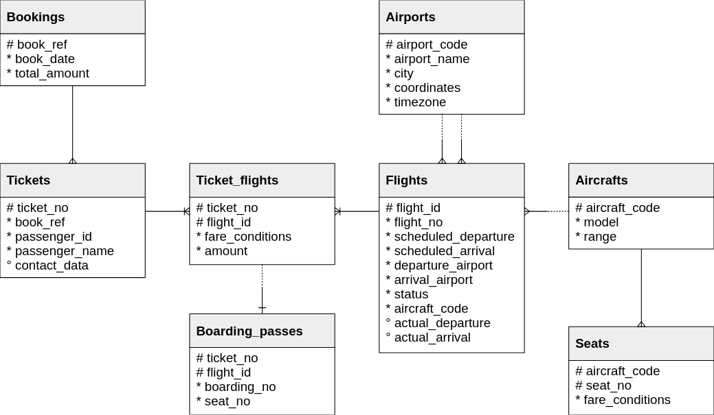

# Practice instance

We need actual data to learn, so we use :
- an instance with more resources than [sandbox](../sandbox)
- a actual dataset : [PostgresPro](https://postgrespro.com/community/demodb) demonstration database (2.5 GB).

## Instance

This instance comes with:
- data persistence (volume);
- 4 CPU, 8Gb RAM;
- connections;
- parallelism enabled;
- minimal WAL support;
- sensible maintenance settings (auto-vacuum, statistics, bgwriter, checkpointer).

You can run it at the same time as the sandbox, as it listen on a different port.

## Install

Start instance

```shell
just start
```

If you have problem, check logs
```shell
just logs
```

In some corporate Linux, you may get this message 
```text
2026-03-03 14:12:29.216 GMT [1] LOG:  could not open configuration file "/etc/postgresql/postgresql.conf": Permission denied
```

If os, change `postgresql.conf` ownership to `microsoft-identity-broker`
```shell
just setup
```

Download dump and import it (3 minutes)
```shell
just create-dataset
```

## Connect

```shell
just console
```

## Physical model



[Source](https://postgrespro.com/docs/postgrespro/15/demodb-schema-diagram.html)


## Tools

### pg_activity

Install 
```shell
sudo apt install pg-activity
``` 

Run
```shell
just pgactivity
```

[Reference](https://github.com/dalibo/pg_activity)

### pg_bench

Install
```shell
sudo apt install postgresql-contrib
```

Run
```shell
just pgbench
```

[Reference](https://www.postgresql.org/docs/current/pgbench.html)

### pg_badger

```shell
just parse-logs
```

[Reference](https://github.com/darold/pgbadger)